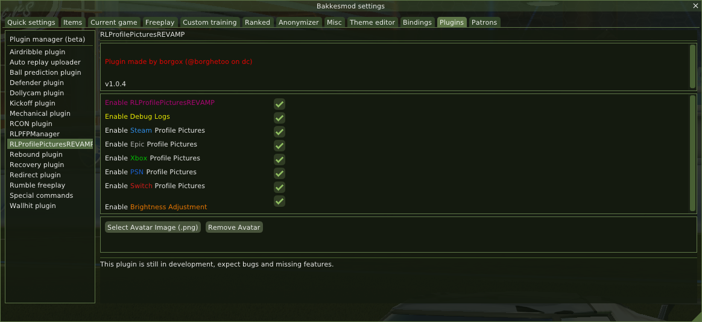
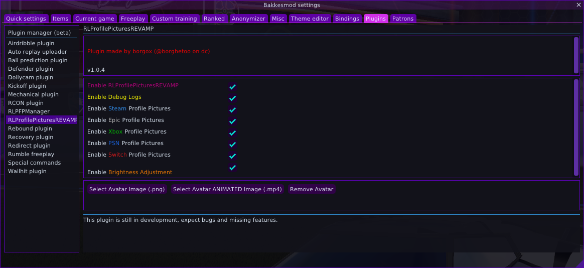

# 🎨 BakkesMod Theme Collection

A curated collection of custom themes for BakkesMod, featuring various color schemes from dark cyberpunk aesthetics to light pastel designs, plus a powerful random theme generator!

*Generated on September 30, 2025*

## 🎲 Random Theme Generator

**NEW!** Generate infinite unique themes with our advanced randomizer:

```bash
python theme_randomizer.py
```

### Features:
- 🎯 **Variant-aware randomization** - Dark themes stay dark, light themes stay light (99% accuracy)
- 🖼️ **Automatic preview generation** - See exactly how your theme looks before applying
- � **Optimized transparency** - Windows stay visible and usable (95% opaque guarantee)
- 🏗️ **Complete theme structure** - Full metadata, proper folder organization
- 🔄 **Unique IDs** - No duplicate theme names

Each generated theme includes:
- `random_XXXX.json` / `random_XXXX_light.json` - Theme files
- `random_XXXX.png` / `random_XXXX_light.png` - Preview images


-----------------------------------------------

## 🎯 Installation Instructions
<details>
<summary>📦 Installation Instructions</summary>

### Quick Installation

1. **Download** your desired theme(s) from the links below
2. **Copy** the `.json` file to your BakkesMod themes directory:
   ```
   %APPDATA%\bakkesmod\bakkesmod\data\themes\
   ```
3. **Apply** the theme by opening console (F6) and typing:
   ```
   theme_load [theme_name]
   ```
   For themes in subfolders (like this collection):
   ```
   theme_load /themes/cyberpunk/cyberpunk_light
   ```

### 🔄 Making Themes Persistent

To make your theme persist between BakkesMod reloads:

1. **Open** your BakkesMod config file:
   ```
   %APPDATA%\bakkesmod\bakkesmod\cfg\config.cfg
   ```
2. **Find** the line containing `bakkesmod_style_theme`
3. **Edit** the line to point to your desired theme:
   ```
   bakkesmod_style_theme "themes/solarflare/solarflare.json" //Theme to use
   ```
   Or for themes in the root themes directory:
   ```
   bakkesmod_style_theme "/solarflare.json" //Theme to use
   ```

**Note:** The path defaults from `%APPDATA%\bakkesmod\bakkesmod\data\themes\` and a `.json` file path must be provided.

</details>

## 🎭 Available Themes

Each theme may include both light and dark variants. **Click to expand** any theme to see preview images and download links:

<details>
<summary>🤖 <strong>Cyber</strong> - A futuristic neon interface theme with glowing cyan and magenta accents on a dark base.</summary>

**Author:** [@borgox](https://github.com/borgox) | [@borghettoo](https://discord.gg/XrqsmAANkC)

#### 🌙 **Dark Variant** | [`cyber.json`](themes/cyber/cyber.json)


#### ☀️ **Light Variant** | [`cyber_light.json`](themes/cyber/cyber_light.json)


</details>

<details>
<summary>🌑 <strong>Dark Mode</strong> - A pure dark theme with high contrast elements for maximum readability. Minimal distractions, just focus.</summary>

**Author:** [@borgox](https://github.com/borgox) | [@borghettoo](https://discord.gg/XrqsmAANkC)

#### 🌙 **Dark Variant** | [`dark_mode.json`](themes/dark_mode/dark_mode.json)


</details>

<details>
<summary>❄️ <strong>Frostbyte</strong> - A cold ice-inspired theme with blue and white tones.</summary>

**Author:** [@borgox](https://github.com/borgox) | [@borghettoo](https://discord.gg/XrqsmAANkC)

#### 🌙 **Dark Variant** | [`frostbyte.json`](themes/frostbyte/frostbyte.json)


#### ☀️ **Light Variant** | [`frostbyte_light.json`](themes/frostbyte/frostbyte_light.json) *(Auto-generated - may need adjustments)*


</details>

<details>
<summary>📺 <strong>Glitch</strong> - A distorted, digital-noise inspired theme with sharp contrasts and neon flashes.</summary>

**Author:** [@borgox](https://github.com/borgox) | [@borghettoo](https://discord.gg/XrqsmAANkC)

#### 🌙 **Dark Variant** | [`glitch.json`](themes/glitch/glitch.json)


#### ☀️ **Light Variant** | [`glitch_light.json`](themes/glitch/glitch_light.json)


</details>

<details>
<summary>🐱 <strong>Kurumi</strong> - A dramatic theme inspired by Kurumi Tokisaki, with black and crimson tones, clock motifs, and a mysterious aura.</summary>

**Author:** [@borgox](https://github.com/borgox) | [@borghettoo](https://discord.gg/XrqsmAANkC)

#### 🌙 **Dark Variant** | [`kurumi.json`](themes/kurumi/kurumi.json)


</details>

<details>
<summary>⚫ <strong>Mono Blue</strong> - A monochromatic blue theme with dark tones and a clean, unified feel.</summary>

**Author:** [@borgox](https://github.com/borgox) | [@borghettoo](https://discord.gg/XrqsmAANkC)

#### 🌙 **Dark Variant** | [`monoblue.json`](themes/monoblue/monoblue.json)


#### ☀️ **Light Variant** | [`monoblue_light.json`](themes/monoblue/monoblue_light.json)


</details>

<details>
<summary>🌿 <strong>Natural</strong> - Inspired by earth tones and nature, with a dark background and subtle organic colors.</summary>

**Author:** [@borgox](https://github.com/borgox) | [@borghettoo](https://discord.gg/XrqsmAANkC)

#### 🌙 **Dark Variant** | [`natural.json`](themes/natural/natural.json)



#### ☀️ **Light Variant** | [`natural_light.json`](themes/natural/natural_light.json)


</details>

<details>
<summary>⚡ <strong>Neon Pulse</strong> - A high-contrast neon theme with strong purple and cyan accents.</summary>

**Author:** [@borgox](https://github.com/borgox) | [@borghettoo](https://discord.gg/XrqsmAANkC)

#### 🌙 **Dark Variant** | [`neonpulse.json`](themes/neonpulse/neonpulse.json)



#### ☀️ **Light Variant** | [`neonpulse_light.json`](themes/neonpulse/neonpulse_light.json) *(Auto-generated - may need adjustments)*


</details>

<details>
<summary>🌸 <strong>Nyanpastel</strong> - A dark version of the nyanpastel theme</summary>

**Author:** [@borgox](https://github.com/borgox) | [@borghettoo](https://discord.gg/XrqsmAANkC)

#### 🌙 **Dark Variant** | [`nyanpastel.json`](themes/nyanpastel/nyanpastel.json)


#### ☀️ **Light Variant** | [`nyanpastel_light.json`](themes/nyanpastel/nyanpastel_light.json) *(Auto-generated - may need adjustments)*


</details>

<details>
<summary>🐱 <strong>Nyan RGB</strong> - A random theme that should be inspired by the Nyan Cat meme and RGB.</summary>

**Author:** [@borgox](https://github.com/borgox) | [@borghettoo](https://discord.gg/XrqsmAANkC)

#### 🌙 **Dark Variant** | [`nyanrgb.json`](themes/nyanrgb/nyanrgb.json)


#### ☀️ **Light Variant** | [`nyanrgb_light.json`](themes/nyanrgb/nyanrgb_light.json) *(Auto-generated - may need adjustments)*


</details>

<details>
<summary>🌸 <strong>Pastel</strong> - A dark base softened by pastel accent colors for a balanced, cozy vibe.</summary>

**Author:** [@borgox](https://github.com/borgox) | [@borghettoo](https://discord.gg/XrqsmAANkC)

#### 🌙 **Dark Variant** | [`pastel.json`](themes/pastel/pastel.json)


#### ☀️ **Light Variant** | [`pastel_light.json`](themes/pastel/pastel_light.json)


</details>

<details>
<summary>📼 <strong>Retrowave</strong> - An 80s-inspired vaporwave theme with pink, purple, and turquoise.</summary>

**Author:** [@borgox](https://github.com/borgox) | [@borghettoo](https://discord.gg/XrqsmAANkC)

#### 🌙 **Dark Variant** | [`retrowave.json`](themes/retrowave/retrowave.json)


#### ☀️ **Light Variant** | [`retrowave_light.json`](themes/retrowave/retrowave_light.json) *(Auto-generated - may need adjustments)*


</details>

<details>
<summary>🔥 <strong>Solar Flare</strong> - A fiery theme with warm orange and yellow tones inspired by the sun.</summary>

**Author:** [@borgox](https://github.com/borgox) | [@borghettoo](https://discord.gg/XrqsmAANkC)

#### 🌙 **Dark Variant** | [`solarflare.json`](themes/solarflare/solarflare.json)


#### ☀️ **Light Variant** | [`solarflare_light.json`](themes/solarflare/solarflare_light.json) *(Auto-generated - may need adjustments)*


</details>

<details>
<summary>💫 <strong>Space</strong> - A cosmic theme with deep blues, purples, and small glowing accents like stars.</summary>

**Author:** [@borgox](https://github.com/borgox) | [@borghettoo](https://discord.gg/XrqsmAANkC)

#### 🌙 **Dark Variant** | [`space.json`](themes/space/space.json)


#### ☀️ **Light Variant** | [`space_light.json`](themes/space/space_light.json)


</details>

<details>
<summary>🎲 <strong>Generated Random Themes</strong> (1 themes) - Click to expand</summary>

*These themes were generated using the random theme generator. Each offers unique color combinations!*

### 🎲 Random Theme 3179

**Author:** [@borgox](https://github.com/borgox) | [@borghettoo](https://discord.gg/XrqsmAANkC)  
**Generated:** Auto-generated theme with unique color combinations

#### 🌙 **Dark** | [`random_3179.json`](themes/random_3179/random_3179.json)


#### ☀️ **Light** | [`random_3179_light.json`](themes/random_3179/random_3179_light.json)


</details>

<details>
<summary>🛠️ <strong>Theme Development Guide</strong> - Click to expand</summary>

## Quick Start - Create Your First Theme

### 🚀 Method 1: Interactive Theme Creator (Recommended)

```bash
python init_theme.py
```

The interactive creator will guide you through:
- **Theme naming** and folder setup
- **Metadata collection** (author, description, category)
- **Variant selection** (dark, light, or both)
- **Template integration** with proper JSON structure
- **Next steps guidance** for customization

### 🎲 Method 2: Random Theme Generator

```bash
python theme_randomizer.py
```

Generate unique themes instantly with:
- **Variant-aware randomization**: 99% accuracy in maintaining dark/light characteristics
- **Smart transparency**: Background windows stay 85-100% opaque
- **Automatic previews**: See exactly how your theme looks
- **Complete structure**: Full metadata and proper organization

### 🛠️ Method 3: Manual Creation

Each theme follows this standard format:

```json
{
  "metadata": {
    "name": "Your Theme Name",
    "author": "Your Name", 
    "version": "1.0",
    "description": "Theme description",
    "category": "dark"
  },
  "imgui": {
    "ImGuiCol_WindowBg": { "r": 0.1, "g": 0.1, "b": 0.1, "a": 1.0 }
  }
}
```

### Templates Available:
- [`/defaults/template/template.json`](defaults/template/template.json) - Dark theme base
- [`/defaults/template/template_light.json`](defaults/template/template_light.json) - Light theme base

### Color Customization Tips:

- **RGBA Values**: Red, Green, Blue, Alpha (transparency) from 0.0 to 1.0
- **Dark Themes**: Keep backgrounds below 0.3 for comfort
- **Light Themes**: Keep backgrounds above 0.7 for visibility
- **Text Colors**: Ensure high contrast with backgrounds
- **Alpha Channel**: Keep windows mostly opaque (0.85-1.0) for usability

</details>

<details>
<summary>🎯 <strong>Theme Categories</strong> - Click to expand</summary>

### 🌙 Dark Themes
Perfect for users who prefer darker interfaces with minimal eye strain during long gaming sessions.

### ☀️ Light Themes  
Bright, clean themes for users who prefer lighter color schemes and better visibility in bright environments.

### 🚀 Cyberpunk & Sci-Fi
Futuristic themes with neon accents, glowing elements, and tech-inspired aesthetics. Perfect for that cyberpunk gaming vibe.

### 🌿 Nature & Earth
Earth-toned themes inspired by natural colors - greens, browns, and organic palettes for a calming experience.

### 🌌 Space & Cosmic
Stellar themes with deep blues, purples, and cosmic colors. Bring the galaxy to your BakkesMod interface.

### 🌈 Retro & Vaporwave
80s-inspired aesthetics with pink, purple, and turquoise. Nostalgic vibes for retro gaming enthusiasts.

### 🎭 Anime & Character
Themes inspired by anime characters and series. Bold, dramatic color schemes with personality.

### 🌸 Pastel & Soft
Gentle, soft color palettes for a calm and soothing interface experience.

### ⚡ Neon & High-Contrast
Bold, glowing themes with strong contrasts and vibrant neon accents for maximum visibility.

### ⚫ Monochrome
Single-color variations and minimalist designs focusing on elegance and simplicity.

### 🔥 Fire & Warm
Themes with warm colors - oranges, yellows, and reds inspired by fire and solar energy.

### 🎲 Random Generated
Infinite unique themes with intelligent color distribution and guaranteed usability.

</details>

<details>
<summary>🤝 <strong>Contributing Guidelines</strong> - Click to expand</summary>

## How to Contribute

We welcome contributions! Here's how you can help:

1. **Fork** this repository
2. **Create** your theme following our format
3. **Test** thoroughly with BakkesMod
4. **Capture** a preview screenshot of your theme in action
5. **Generate** a new README.md with [this script](generate_readme.py)
6. **Submit** a pull request with clear description

### Submission Requirements

- Follow the established folder structure: `/themes/themename/`
- Include both `.json` theme file and `.png` preview
- Provide both light and dark variants when possible
- Use descriptive theme names and clear descriptions
- Test themes extensively before submitting
- Generate an updated README using the provided script

### Using the Random Generator for Inspiration

1. Run `python theme_randomizer.py` to generate unique themes
2. Use generated themes as starting points for manual refinement
3. Modify colors to match your vision while keeping the structure
4. Create custom previews if desired

</details>

<details>
<summary>📋 <strong>Requirements & Support</strong> - Click to expand</summary>

## Requirements

- **BakkesMod** (latest version recommended)
- **Rocket League** (Steam/Epic Games)
- **Python 3.6+** (for theme randomizer)
- **Pillow** library (for preview generation): `pip install Pillow`

## 🐛 Issues & Support

Having problems with a theme? 

1. Check that the theme file is in the correct directory
2. Ensure BakkesMod is updated to the latest version
3. Try restarting BakkesMod/Rocket League
4. Use console command: `theme_load [theme_name]`
5. Create an issue in this repository with details

### Random Theme Generator Issues

- **"PIL not found"**: Install Pillow with `pip install Pillow`
- **"Template not found"**: Ensure you're running from the repository root
- **Themes not appearing**: Check the generated `themes/random_XXXX/` folders

## 📄 License

This collection is open source. Individual themes may have different licenses - check each theme's metadata for specific author information.

</details>

## 🙏 Credits

- **[borgox](https://github.com/borgox) | [@borghettoo](https://discord.com/users/@borghettoo)** - Theme development and collection curation
- **bakkesmod.com** - Platform and default themes

---

*Made with ❤️ for the BakkesMod community*

- **Total Unique Themes:** 15 themes with variants
- **Total Theme Files:** 28 `.json` files
- **Last Updated:** September 30, 2025
