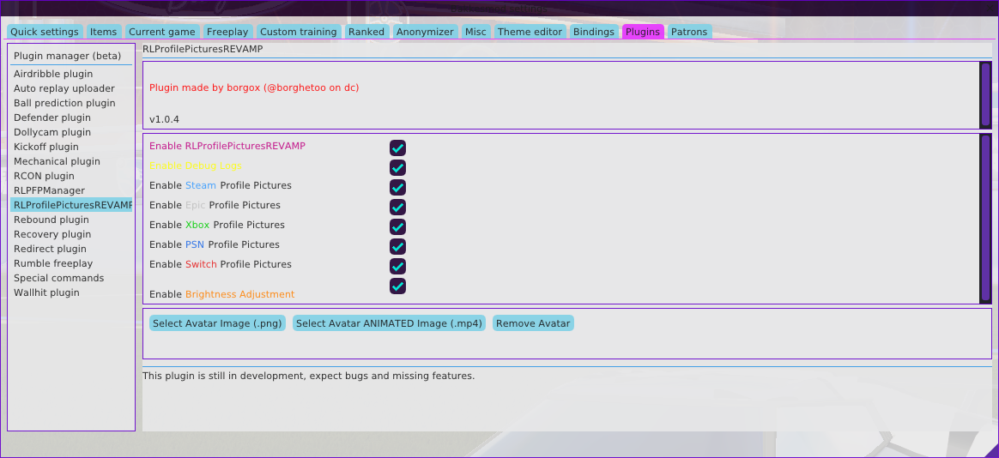
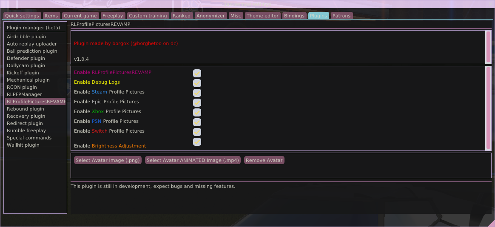
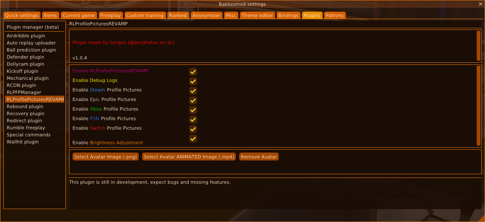

# 🎨 BakkesMod Theme Collection

A curated collection of custom themes for BakkesMod, featuring various color schemes from dark cyberpunk aesthetics to light pastel designs.

*Generated on September 28, 2025*

## 📦 Quick Installation

1. **Download** your desired theme(s) from the links below
2. **Copy** the `.json` file to your BakkesMod themes directory:
   ```
   %APPDATA%\bakkesmod\bakkesmod\data\themes\
   ```
3. **Apply** the theme by opening console (F6) and typing:
   ```
   theme_load [theme_name]
   ```
   For themes in subfolders (like this collection):
   ```
   theme_load /themes/cyberpunk/cyberpunk_light
   ```

## 🎭 Available Themes

Each theme may include both light and dark variants. Click the download links below to get the `.json` files directly.

## 🌟 Cyberpunk

**Author:** [@borgox](https://github.com/borgox) | [@borghettoo](https://discord.gg/XrqsmAANkC)  
**Description:** A futuristic neon theme with dark backgrounds and vibrant cyberpunk highlights.

### 🌙 **Dark** | [`cyberpunk.json`](themes/cyberpunk/cyberpunk.json)


----

### ☀️ **Light** | [`cyberpunk_light.json`](themes/cyberpunk/cyberpunk_light.json) *(Auto-generated - may need adjustments)*


----


--------------

## 🌟 Frostbyte

**Author:** [@borgox](https://github.com/borgox) | [@borghettoo](https://discord.gg/XrqsmAANkC)  
**Description:** A cold ice-inspired theme with blue and white tones.

### 🌙 **Dark** | [`frostbyte.json`](themes/frostbyte/frostbyte.json)


----

### ☀️ **Light** | [`frostbyte_light.json`](themes/frostbyte/frostbyte_light.json) *(Auto-generated - may need adjustments)*


----


--------------

## 🌟 Neon Pulse

**Author:** [@borgox](https://github.com/borgox) | [@borghettoo](https://discord.gg/XrqsmAANkC)  
**Description:** A high-contrast neon theme with strong purple and cyan accents.

### 🌙 **Dark** | [`neonpulse.json`](themes/neonpulse/neonpulse.json)


----

### ☀️ **Light** | [`neonpulse_light.json`](themes/neonpulse/neonpulse_light.json) *(Auto-generated - may need adjustments)*



----


--------------

## 🌟 Nyanpastel

**Author:** [@borgox](https://github.com/borgox) | [@borghettoo](https://discord.gg/XrqsmAANkC)  
**Description:** A dark version of the nyanpastel theme

### 🌙 **Dark** | [`nyanpastel.json`](themes/nyanpastel/nyanpastel.json)



----

### ☀️ **Light** | [`nyanpastel_light.json`](themes/nyanpastel/nyanpastel_light.json) *(Auto-generated - may need adjustments)*


----


--------------

## 🌟 Nyan RGB

**Author:** [@borgox](https://github.com/borgox) | [@borghettoo](https://discord.gg/XrqsmAANkC)  
**Description:** A random theme that should be inspired by the Nyan Cat meme and RGB.

### 🌙 **Dark** | [`nyanrgb.json`](themes/nyanrgb/nyanrgb.json)


----

### ☀️ **Light** | [`nyanrgb_light.json`](themes/nyanrgb/nyanrgb_light.json) *(Auto-generated - may need adjustments)*


----


--------------

## 🌟 Nyan Pastel

**Author:** [@borgox](https://github.com/borgox) | [@borghettoo](https://discord.gg/XrqsmAANkC)  
**Description:** An 80s-inspired vaporwave theme with pink, purple, and turquoise.

### 🌙 **Dark** | [`retrowave.json`](themes/retrowave/retrowave.json)


----

### ☀️ **Light** | [`retrowave_light.json`](themes/retrowave/retrowave_light.json) *(Auto-generated - may need adjustments)*


----


--------------

## 🌟 Solar Flare

**Author:** [@borgox](https://github.com/borgox) | [@borghettoo](https://discord.gg/XrqsmAANkC)  
**Description:** A fiery theme with warm orange and yellow tones inspired by the sun.

### 🌙 **Dark** | [`solarflare.json`](themes/solarflare/solarflare.json)



----

### ☀️ **Light** | [`solarflare_light.json`](themes/solarflare/solarflare_light.json) *(Auto-generated - may need adjustments)*


----


--------------

## 🛠️ Theme Development

### Creating Custom Themes

Each theme follows this standard theme format:

```json
{
  // Added metadata that bakkesmod doesn't care about
  "metadata": {
    "name": "Your Theme Name",
    "author": "Your Name", 
    "version": "1.0",
    "description": "Theme description"
  },
  "imgui": { // Bakkesmod ImGUI theme config
    "ImGuiCol_WindowBg": { "r": 0.1, "g": 0.1, "b": 0.1, "a": 1.0 },
    // ... other color definitions
  }
}
```

You can use [`/defaults/default.json`](defaults/default.json) as a base for your theme.

## 🎯 Theme Categories

### 🌙 Dark Themes
Perfect for users who prefer darker interfaces with minimal eye strain during long gaming sessions.

### ☀️ Light Themes  
Bright, clean themes for users who prefer lighter color schemes and better visibility in bright environments.

### 🎨 Colorful Themes
Bold, vibrant themes with distinctive color palettes and unique visual flair.

### ♿ Accessibility
High contrast themes designed for better visibility and accessibility compliance.

## 🤝 Contributing

We welcome contributions! Here's how you can help:

1. **Fork** this repository
2. **Create** your theme following our format
3. **Test** thoroughly with BakkesMod
4. **Capture** a preview screenshot of your theme in action
5. **Update** the README.md with your theme information
6. **Submit** a pull request with clear description

### Contribution Guidelines

- Follow the established folder structure: `/themes/themename/`
- Include both `.json` theme file and `.png` preview
- Provide both light and dark variants when possible
- Use descriptive theme names and clear descriptions
- Test themes extensively before submitting
- Update README.md with your theme details before submitting

## 📋 Requirements

- **BakkesMod** (latest version recommended)
- **Rocket League** (Steam/Epic Games)

## 🐛 Issues & Support

Having problems with a theme? 

1. Check that the theme file is in the correct directory
2. Ensure BakkesMod is updated to the latest version
3. Try restarting BakkesMod/Rocket League
4. Use console command: `theme_load [theme_name]`
5. Create an issue in this repository with details

## 📄 License

This collection is open source. Individual themes may have different licenses - check each theme's metadata for specific author information.

## 🙏 Credits

- **[borgox](https://github.com/borgox) | [@borghettoo](https://discord.com/users/@borghettoo)** - Theme development and collection curation
- **bakkesmod.com** - Platform and default themes

---

*Made with ❤️ for the BakkesMod community*

**Total Themes:** 7 themes with variants
